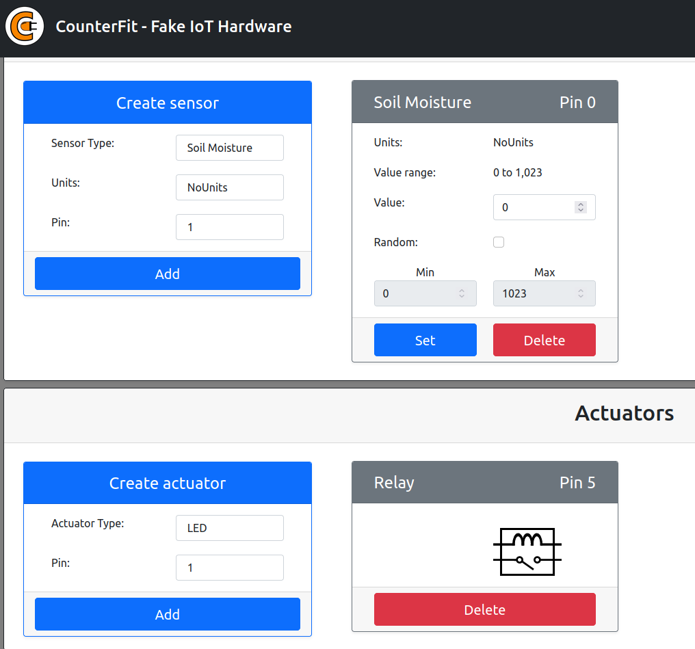
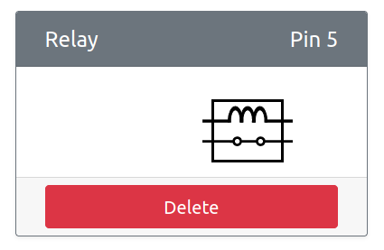

#

## Setup

To test the user interface install and run ```counterfit``

This will start a web application in your browser at http://localhost:5000

Create a Soil Moisture sensor on pin 0 and a Relay actuator on pin 5.

Note that the relay switch should be open. This is the **off** state.



## Check the UI

Run ```application.py```

When the relay is on the image in ```counterfit``` will show a closed switch.

